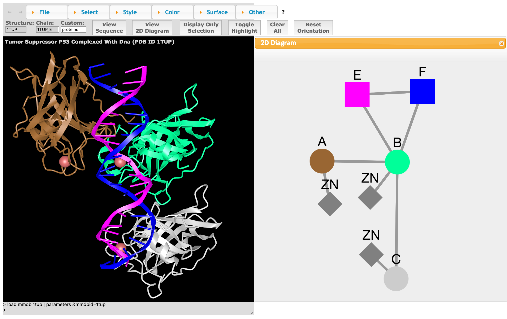

# 2D/3D molecular interaction networks visualization 

## Usage
2D molecular network diagrams are created from protein 3D structures to represent, select and visualize molecular interactions in both 3D and 2D simultaneously, using cytoscape.js .  2D windows appear side by side with a 3D window (iCn3D) under a web browser

## Tools depending on

We added a 2D viewer (molecular network) as a window/widget within iCn3D. iCn3D itself is accessible from GitHub at https://github.com/ncbi/icn3d

# Contributors

- Jiyao Wang
- Eli Draizen
- Keiichiro Oto
- Jose Duarte
- Peter Kerpedjiev
- Philippe Youkharibache
- Quiangling (Leon) Li
- Spencer Bliven

